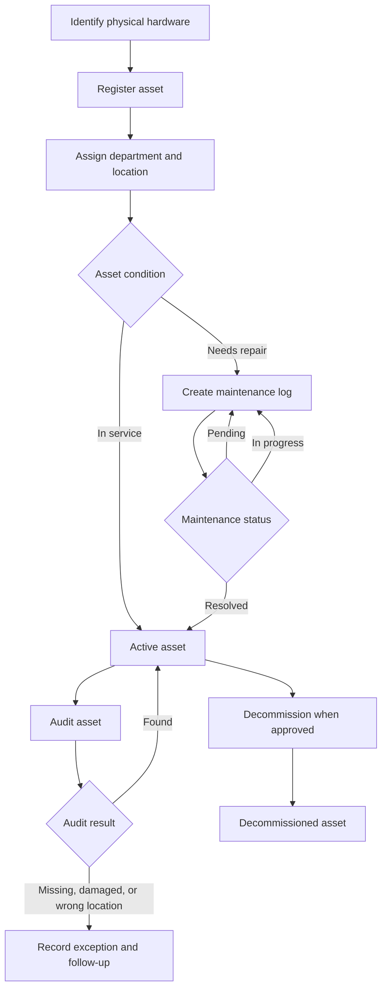
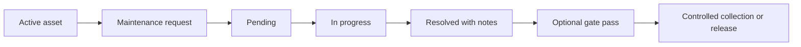
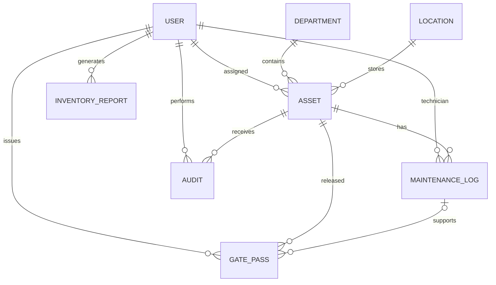

# APPENDICES: SUPPLEMENTARY SYSTEM DOCUMENTATION

This document contains supplementary material that can be placed after Chapter 7 of the NRZ Hardware Department Inventory System report. It is written from the current Laravel and FilamentPHP implementation. Demonstration records, local credentials, and proposed operational controls must be replaced or confirmed before the document is used as a production handover.

### QR Code Connectivity Requirement

The QR label stores a signed URL to the application's asset-information route; it does not store a complete offline copy of the asset record. A phone or workstation scanning the label must therefore be able to reach the server hosting the application. Never generate production labels with `localhost`, `127.0.0.1`, or an unreachable private address. For local Wi-Fi testing, set `APP_URL` and `QR_BASE_URL` to the host computer's LAN address, start Laravel with `php artisan serve --host=0.0.0.0 --port=8000`, allow the port through the firewall, and ensure the scanning device is on the same network. For production, use the approved DNS name or HTTPS server URL. Existing labels containing `localhost` cannot be repaired by changing the database; they must be regenerated after the URL is corrected.

## Appendix A: Document Control and System Profile

| Item                     | Description                                                                                                                        |
| ------------------------ | ---------------------------------------------------------------------------------------------------------------------------------- |
| System name              | NRZ Hardware Department Inventory System                                                                                           |
| Application type         | Authenticated web-based administrative inventory system                                                                            |
| Main framework           | Laravel 12                                                                                                                         |
| Administrative interface | FilamentPHP 5.7                                                                                                                    |
| Backend language         | PHP 8.2 or later                                                                                                                   |
| Database                 | MySQL-compatible relational database                                                                                               |
| Frontend tools           | Tailwind CSS, Vite, Alpine.js, and Axios                                                                                           |
| Authentication           | Laravel authentication and hashed passwords                                                                                        |
| Authorization            | Spatie Laravel Permission with roles and permissions                                                                               |
| QR generation            | Simple QrCode package with signed asset-information URLs                                                                           |
| Automated testing        | PHPUnit through Laravel's test runner                                                                                              |
| Current status           | Development and demonstration system; production rollout is still subject to approval, migration, training, and acceptance testing |

### A.1 Version Record

| Version | Date       | Description                                | Prepared by  | Approved by     |
| ------- | ---------- | ------------------------------------------ | ------------ | --------------- |
| 1.0     | 2026-09-09 | Initial supplementary system documentation | Project team | To be completed |

### A.2 Implementation Boundary

The current implementation includes authentication, role-based access, asset records, maintenance logs, audits, gate passes, QR code display, dashboard statistics, saved inventory reports, and PDF report downloads. It does not currently include a dedicated mobile scanner workflow, CSV import, uploaded asset documents, Excel exports, automated notifications, universal activity logging, or automated production backups. These items should be listed as future enhancements rather than as completed features.

## Appendix B: User Quick-Reference Manual

### B.1 Signing In

1. Open the approved application URL in a supported browser.
2. Enter the user email address and password.
3. Select the sign-in action.
4. Confirm that the dashboard and navigation items match the user's assigned role.
5. Sign out when work is complete, particularly on a shared workstation.

If a menu item is unavailable, the user may not have the permission required for that function. The user should contact the system administrator rather than attempting to bypass the permission control.

### B.2 Registering an Asset

1. Open the Assets section and select the create action.
2. Enter a unique asset tag and serial number.
3. Enter the hardware type, brand, specifications, purchase date, and warranty expiry date where known.
4. Select the existing department and location.
5. Enter assignment details only when the asset is issued to a user.
6. Select the appropriate lifecycle status.
7. If the asset is decommissioned, enter the condemnation reason and date.
8. Review the information and save the record.

Asset tags and serial numbers must be checked against the physical item before saving. The application rejects duplicate unique identifiers.

### B.3 Updating an Asset

Update the existing asset record when its current department, location, assigned user, warranty information, or lifecycle status changes. Keep the asset tag and serial number unchanged unless an approved data-correction process has been followed. Maintenance, audit, and gate pass activities should be recorded in their own modules so that the asset record is not used as a substitute for operational history.

### B.4 Viewing an Asset QR Code

1. Open the asset list.
2. Locate the asset using the asset tag, serial number, or table filters.
3. Select the QR code action for the asset.
4. Confirm that the displayed code belongs to the intended asset.
5. Use the generated code only from the approved application environment.

The current system generates the QR code dynamically. It does not provide a separate mobile scanning application or automatically update an asset after a scan.

### B.5 Recording Maintenance

1. Open Maintenance and create a maintenance record.
2. Select an active asset.
3. Select the technician and enter the reported symptom and description.
4. Use `pending` when the work has not started.
5. Use `in_progress` while the issue is being investigated or repaired.
6. Use `resolved` only after the work is complete.
7. For a resolved record, enter the resolution date and resolution notes.
8. Save the record and retain any physical service documentation according to NRZ policy.

Maintenance status is separate from the asset lifecycle status. Resolving a maintenance record does not automatically change the asset's lifecycle state.

### B.6 Completing an Audit

1. Open Audits and create an audit record.
2. Select the asset being checked.
3. Record the checking user and date/time.
4. Select `found`, `missing`, `damaged`, or `wrong location`.
5. Record the physical location, condition, and follow-up information in the notes.
6. Save the record and report exceptions through the approved management process.

### B.7 Issuing a Gate Pass

1. Confirm that the asset and collector identity have been verified.
2. Open Gate Passes and create a new pass.
3. Select the asset and, where applicable, the related resolved maintenance record.
4. Enter the collector name, contact details, identification or employee number, and release date/time.
5. Confirm the issuing user and enter handover notes.
6. Save the record and retain the pass according to local control procedures.

### B.8 Generating a Report

1. Open the Reports page.
2. Review the asset distributions by type, department, and location.
3. Review maintenance status counts and warranty information.
4. Enter a report title and select the report type when saving a report.
5. Add notes that explain unusual values or follow-up actions.
6. Confirm the generated report user and date/time.

The current Reports page displays summaries, saves report data, and provides a PDF download. Microsoft Excel export is not currently included.

## Appendix C: Data Dictionary

### C.1 Core Tables

| Table               | Purpose                                     | Important fields                                                                                   |
| ------------------- | ------------------------------------------- | -------------------------------------------------------------------------------------------------- |
| `users`             | Authenticated accounts and staff references | `name`, `email`, `password`, `email_verified_at`                                                   |
| `departments`       | Organizational units                        | `name`                                                                                             |
| `locations`         | Stations or physical locations              | `name`, `code`                                                                                     |
| `assets`            | Central hardware inventory records          | `asset_tag`, `serial_number`, `type`, `brand`, `specs`, `department_id`, `location_id`, `status`   |
| `maintenance_logs`  | Repair and service history                  | `asset_id`, `technician_id`, `symptom`, `description`, `status`, `resolved_at`, `resolution_notes` |
| `audits`            | Physical verification records               | `asset_id`, `audited_by`, `result`, `checked_at`, `notes`                                          |
| `gate_passes`       | Controlled asset release or collection      | `pass_number`, `asset_id`, `maintenance_log_id`, `issued_by`, `released_at`                        |
| `inventory_reports` | Saved report summaries                      | `title`, `type`, `summary`, `generated_by`, `generated_at`, `notes`                                |
| Permission tables   | Roles and permission assignments            | permission, role, model, and relationship records managed by Spatie Laravel Permission             |

### C.2 Controlled Values

| Field                                    | Current values                                  |
| ---------------------------------------- | ----------------------------------------------- |
| Asset lifecycle status                   | `active`, `decommissioned`                      |
| Maintenance status                       | `pending`, `in_progress`, `resolved`            |
| Audit result                             | `found`, `missing`, `damaged`, `wrong location` |
| Report type                              | Inventory summary, maintenance, warranty        |
| Common asset types in demonstration data | Laptop, Desktop, Printer, Server, Radio         |

### C.3 Required Relationship Rules

An asset belongs to a department and a location. An asset may be assigned to a user and may have many maintenance logs and audits. A maintenance log belongs to an asset and may identify a technician. A gate pass belongs to an asset and may reference a maintenance log and issuing user. An inventory report belongs to the user who generated it. The current design stores the latest asset assignment directly on the asset; it does not use a separate assignment-history table.

## Appendix D: Roles and Permission Matrix

The following matrix reflects the permissions seeded by `DatabaseSeeder`. A blank cell means that the permission is not assigned by the default role seed. Individual permissions may be adjusted by an authorized administrator.

| Permission         | Administrator | Inventory Manager | Technician | Auditor | Read Only |
| ------------------ | :-----------: | :---------------: | :--------: | :-----: | :-------: |
| View assets        |      Yes      |        Yes        |    Yes     |   Yes   |    Yes    |
| Create assets      |      Yes      |        Yes        |     No     |   No    |    No     |
| Edit assets        |      Yes      |        Yes        |     No     |   No    |    No     |
| Delete assets      |      Yes      |        Yes        |     No     |   No    |    No     |
| Condemn assets     |      Yes      |        Yes        |     No     |   No    |    No     |
| View maintenance   |      Yes      |        Yes        |    Yes     |   Yes   |    Yes    |
| Manage maintenance |      Yes      |        Yes        |    Yes     |   No    |    No     |
| Manage users       |      Yes      |        No         |     No     |   No    |    No     |
| View reports       |      Yes      |        Yes        |     No     |   Yes   |    No     |
| Manage audits      |      Yes      |        Yes        |     No     |   Yes   |    No     |
| Manage gate passes |      Yes      |        Yes        |     No     |   No    |    No     |

The matrix is an operational starting point. NRZ management should approve the final separation of duties, especially for asset deletion, condemnation, user administration, and gate pass issuance.

## Appendix E: System Workflows and Diagrams

### E.1 Asset Lifecycle Workflow

### E.2 Maintenance and Gate Pass Workflow

### E.3 Entity Relationship Overview

## Appendix F: Demonstration Data Inventory

The `DatabaseSeeder` creates the following repeatable demonstration data. These values are not production NRZ records.

| Category         | Demonstration values                                             |
| ---------------- | ---------------------------------------------------------------- |
| Roles            | Administrator, Inventory Manager, Technician, Auditor, Read Only |
| Departments      | IT, Finance, HR, Audit, Security, Traffic, Marketing             |
| Locations        | Bulawayo, Rutenga, Harare, Lowveld                               |
| Users            | Test User, Thandiwe Moyo, Brian Ncube, Rudo Chikwanha            |
| Assets           | One laptop, one desktop, one printer, one server, one radio      |
| Maintenance logs | Two records: one in progress and one resolved                    |
| Audits           | Two records: one found and one missing                           |
| Gate passes      | One demonstration gate pass                                      |

For local demonstration only, the seeder assigns the password `password` to its sample accounts. This password must not be used in production and must be changed or removed before any live deployment.

## Appendix G: Installation and Technical Handover Checklist

### G.1 Environment Preparation

- [ ] Confirm PHP 8.2 or later, Composer, Node.js, npm, and a MySQL-compatible database.
- [ ] Create a production database and least-privilege database user.
- [ ] Copy `.env.example` to the approved environment configuration file.
- [ ] Set `APP_ENV=production` and `APP_DEBUG=false`.
- [ ] Set the production `APP_URL` and QR base URL to an approved reachable address.
- [ ] Generate and protect the Laravel application key.
- [ ] Configure database, mail, cache, session, and filesystem settings.
- [ ] Ensure the web server can write to `storage` and `bootstrap/cache`.
- [ ] Enable HTTPS and confirm the certificate is valid for the application URL.

### G.2 Deployment Verification

- [ ] Install PHP dependencies with the approved Composer deployment command.
- [ ] Install and build frontend dependencies with the approved npm procedure.
- [ ] Run database migrations only after a verified backup or empty-database decision.
- [ ] Clear and rebuild application configuration caches.
- [ ] Confirm login, logout, password handling, and role restrictions.
- [ ] Confirm asset creation, unique validation, QR generation, maintenance, audit, gate pass, and report workflows.
- [ ] Confirm a generated QR link is reachable from the intended user network.
- [ ] Create an initial administrator account using a secure, unique password.
- [ ] Remove or disable demonstration users and sample records before go-live.

### G.3 Operational Handover

- [ ] Name the application owner and technical support contact.
- [ ] Approve the role and permission matrix.
- [ ] Approve the data migration mapping and exception-handling process.
- [ ] Define backup frequency, retention, encryption, storage, and restoration testing.
- [ ] Record the release version and deployment date.
- [ ] Provide the user manual and administrator contact procedure.
- [ ] Obtain user acceptance approval before declaring production operation.

## Appendix H: Data Migration and Reconciliation Template

| Source record ID | Source location | Proposed asset tag | Serial number | Department | Location | Assigned user | Migration status | Exception or action |
| ---------------- | --------------- | ------------------ | ------------- | ---------- | -------- | ------------- | ---------------- | ------------------- |
|                  |                 |                    |               |            |          |               | Pending review   |                     |

### H.1 Migration Procedure

1. Identify the approved source registers, spreadsheets, and paper records.
2. Preserve a read-only copy of each source before cleansing.
3. Standardize department, location, asset type, and status names.
4. Check asset tags, serial numbers, and MAC addresses for duplicates.
5. Resolve incomplete or conflicting rows with the responsible department.
6. Map only validated rows to departments, locations, users, and assets.
7. Import or enter the data in a controlled test database first.
8. Compare source and destination counts and produce an exception list.
9. Verify a documented sample against the physical assets.
10. Obtain approval before applying the final migration to production.

## Appendix I: Test Evidence and User Acceptance Checklist

### I.1 Automated Test Evidence

The repository contains automated tests for authentication, registration, email verification, password management, password confirmation, profile updates, account deletion, authorization behavior, and the basic application response. The inventory-specific test areas below should be added or recorded before final production acceptance.

| Test area                | Expected evidence                                                   | Status         |
| ------------------------ | ------------------------------------------------------------------- | -------------- |
| Asset creation           | Valid asset saves with department and location                      | To be verified |
| Unique identifiers       | Duplicate asset tag and serial number are rejected                  | To be verified |
| Asset authorization      | Each role receives only approved asset actions                      | To be verified |
| Maintenance workflow     | Pending, in-progress, and resolved records behave correctly         | To be verified |
| Audit workflow           | All four audit results can be recorded and viewed                   | To be verified |
| Gate pass workflow       | Unique pass and resolved maintenance association work               | To be verified |
| Report calculations      | Inventory, maintenance, and warranty summaries match source records | To be verified |
| QR action                | Signed URL is generated for the selected asset                      | To be verified |
| Role restrictions        | Unauthorized users cannot access restricted pages or actions        | To be verified |
| Production configuration | Debug is disabled and QR URL is reachable                           | To be verified |

### I.2 User Acceptance Scenarios

| Scenario                                   | User role         | Result | Evidence reference | Date |
| ------------------------------------------ | ----------------- | ------ | ------------------ | ---- |
| Register and assign an asset               | Inventory Manager |        |                    |      |
| Search for an asset and view QR code       | Inventory Manager |        |                    |      |
| Create and resolve a maintenance record    | Technician        |        |                    |      |
| Complete a physical audit                  | Auditor           |        |                    |      |
| Issue a gate pass for a repaired asset     | Inventory Manager |        |                    |      |
| Review dashboard and save a report         | Inventory Manager |        |                    |      |
| Confirm restricted actions are unavailable | Read Only         |        |                    |      |

### I.3 Acceptance Sign-off

| Role                        | Name | Signature | Date |
| --------------------------- | ---- | --------- | ---- |
| Project supervisor          |      |           |      |
| NRZ business representative |      |           |      |
| System administrator        |      |           |      |
| Inventory Manager           |      |           |      |

## Appendix J: Backup, Recovery, and Incident Log Templates

### J.1 Backup and Recovery Record

| Date/time | Backup type | Scope | Storage location | Result | Verified by |
| --------- | ----------- | ----- | ---------------- | ------ | ----------- |
|           |             |       |                  |        |             |

Backups should include the production database, application source and deployment configuration, and any operational files introduced after deployment. Environment secrets must be protected separately and must not be included in unsecured documentation. A restoration test should record the restored version, test result, responsible person, and any corrective action.

### J.2 Incident Record

| Incident number | Date/time | Reporter | Affected function | Description | Immediate action | Root cause | Resolution date |
| --------------- | --------- | -------- | ----------------- | ----------- | ---------------- | ---------- | --------------- |
|                 |           |          |                   |             |                  |            |                 |

Incidents involving unauthorized access, incorrect asset data, unavailable services, lost records, broken QR links, or failed backups should be escalated according to NRZ IT policy. The record should contain enough information to support later review without storing passwords or other secrets.

## Appendix K: Recommended Figures and Screenshots

The final printed report may include the following figures captured from the approved environment:

1. Login page.
2. Dashboard showing inventory overview statistics.
3. Asset list with search, filters, and QR action.
4. Asset creation or edit form.
5. Maintenance record form showing controlled status values.
6. Audit form showing physical verification results.
7. Gate pass form.
8. Reports page showing inventory, maintenance, and warranty summaries.
9. Generated QR code modal and corresponding asset-information page.
10. Role and permission administration screen, where accessible.

Each screenshot should have a figure number, a descriptive caption, the capture date, and a note stating whether it shows demonstration or approved production data. Personal information, passwords, internal URLs, and confidential asset details should be removed or anonymized before inclusion in the final report.

## Appendix L: Glossary

| Term                    | Meaning                                                                              |
| ----------------------- | ------------------------------------------------------------------------------------ |
| Asset tag               | Organization-defined identifier attached to a physical item                          |
| Audit                   | A recorded comparison between the physical asset and its database record             |
| Gate pass               | A record authorizing or documenting controlled asset collection or release           |
| Lifecycle status        | The current service state of an asset, such as active or decommissioned              |
| Maintenance status      | The progress state of a repair record                                                |
| QR code                 | A two-dimensional code generated here for a signed asset-information URL             |
| Role                    | A named group of permissions assigned to a user                                      |
| Signed URL              | A URL containing a verifiable signature that helps prevent unauthorized modification |
| Seeding                 | The process of inserting repeatable development or demonstration data                |
| User acceptance testing | Verification by representative users that agreed workflows meet operational needs    |

## Appendix M: Final Appendix Review Checklist

- [ ] All screenshots show approved or anonymized data.
- [ ] Demonstration credentials are removed from the production handover.
- [ ] Implemented functions and future enhancements are clearly separated.
- [ ] The permission matrix has been reviewed by NRZ management.
- [ ] The data dictionary matches the final migrations.
- [ ] The entity relationship diagram matches the implemented relationships.
- [ ] Automated test output is attached or referenced accurately.
- [ ] User acceptance results include names, dates, and evidence references.
- [ ] Backup and restoration responsibilities have been assigned.
- [ ] The final appendix version is recorded in the document control table.
